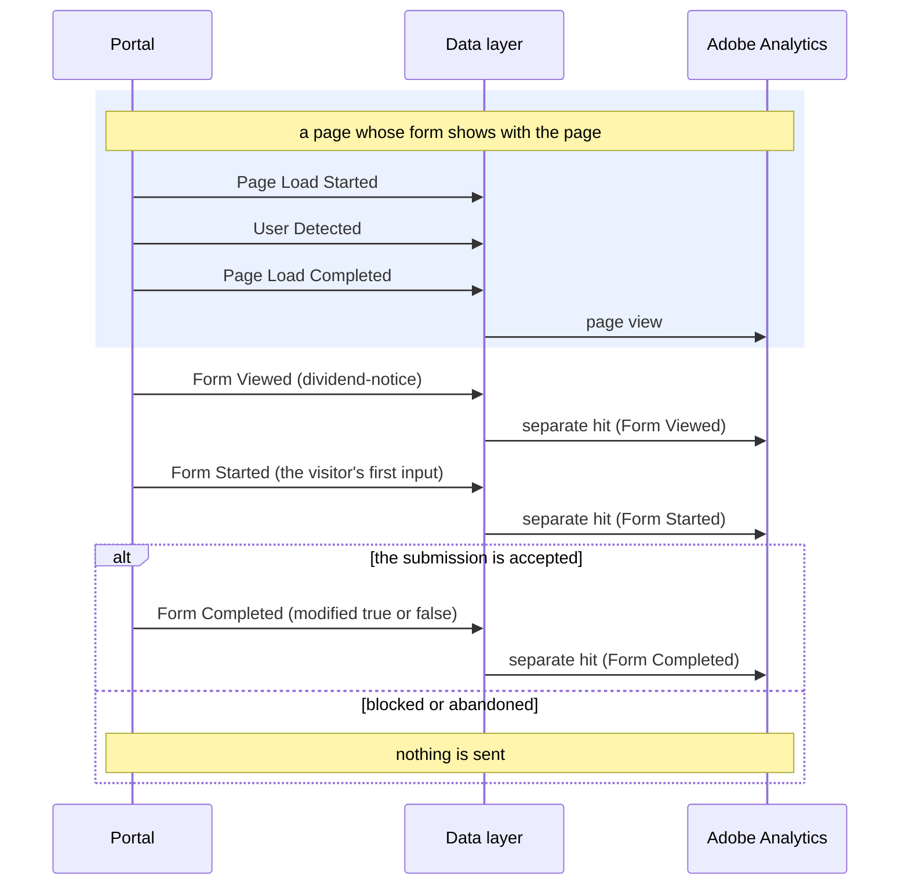

# Form Started

**Event name:** `Form Started` · Recommended

[Back to the overview](../README.md)

> **The three form events.** Form Viewed, Form Started and Form Completed describe **engagement
> forms**: a form your portal builds that moves a visitor toward an application. Chat now and
> Schedule a call open your vendors' pages in a window, so nothing inside them can be tracked
> (2026-11-03 office hours).
> They replace the earlier Form Activity event and carry no field-level detail (agreed at the
> 2026-10-23 office hours). The application and the quote are recorded by the
> [application events](application-activity.md); the resume and advisor login forms by
> [Login Activity](login-activity.md). Your forms list ([decision 26](../open-questions.md),
> answered 2026-11-10) has one engagement form: the **dividend notice**, on Home and Review, used
> by ABE only. `dividend-notice` is the example.

## What it answers

- How many visitors who see an engagement form start filling it in: the drop between viewed and
  started.

## When to fire it

- **Fire this event at the visitor's first input on any field of the form**: typing, picking an
  option, ticking a box, or choosing a browser autofill. Once each time the form is shown, as its
  own hit.
- **Not** on a click into a field alone, a click on a button, or values the portal filled in
  itself: reaching a pre-filled form starts nothing (agreed on 2026-10-23).
- **Never send what was typed:** no field names, no values, no error text. See
  [Privacy](../privacy.md).
- **Do not fire it for:** the application or the quote, the resume and advisor login forms, the
  Needs Calculator (it has no submit), or Chat now and Schedule a call themselves (those are
  [Click Interaction](click-interaction.md)), anything inside a vendor's window (chat, scheduling,
  identity verification, the QuickDecision health questions, DocuSign) or the payment card
  window.

## Example


```mermaid
sequenceDiagram
  participant UI as Portal
  participant DL as Data layer
  participant AA as Adobe Analytics
  rect rgba(80,140,255,0.12)
    Note over UI,AA: a page whose form shows with the page
    UI->>DL: Page Load Started
    UI->>DL: User Detected
    UI->>DL: Page Load Completed
    DL->>AA: page view
  end
  UI->>DL: Form Viewed (dividend-notice)
  DL->>AA: separate hit (Form Viewed)
  UI->>DL: Form Started (the visitor's first input)
  DL->>AA: separate hit (Form Started)
  alt the submission is accepted
    UI->>DL: Form Completed (modified true or false)
    DL->>AA: separate hit (Form Completed)
  else blocked or abandoned
    Note over UI,AA: nothing is sent
  end
```

## Javascript code

```js
window.appEventData = window.appEventData || [];
window.appEventData.push({
  "event": "Form Started",
  "form": {
    "name": "<formName>",
    "category": "<formCategory>",
    "prefilled": "<formPrefilled>",
    "modified": "<formModified>"
  }
});
```

## Populated example

The visitor makes a first entry in the dividend notice:

```js
window.appEventData = window.appEventData || [];
window.appEventData.push({
  "event": "Form Started",
  "form": {
    "name": "dividend-notice",
    "category": "notice",
    "prefilled": false,
    "modified": null
  }
});
```

## Variable definitions

All details are sent every time; a detail that does not apply is `null`. The same details go on
Form Viewed, Form Started and Form Completed.

| Path | Type | Description | Example |
|---|---|---|---|
| `form.name` | string | Required. Which form, by a fixed id. The list is [decision 26](../open-questions.md) | `dividend-notice` |
| `form.category` | string | Required. The kind of engagement form | `notice` |
| `form.prefilled` | boolean | Required. `true` when the form opened with values the portal filled in itself; says that values were there, never which | `true`, `false` |
| `form.modified` | boolean or null | Required. Only on Form Completed; empty here | `true`, `false`, `null` |

## How to check it

1. Make a first entry in the dividend notice: one Form Started; more entries add nothing.
2. Open a form that arrives pre-filled and do nothing: no Form Started.
3. Each push has `event` and `form` only, with all four details.
